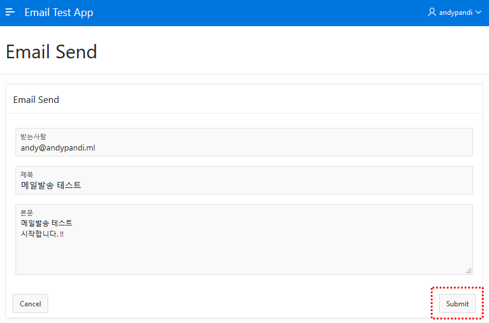

# Oracle APEX with Email Delivery

이번에 테스트할 내용은 Oracle의 low-code platform 인 Oracle APEX(Application express)을 활용한 Email Delivery Service 사용 입니다.

#### Part 1. OCI User 의 SMTP Credential 생성

1. Email Delivery Service 를 사용해 메일을 발송할 OCI 유저의 SMTP Credential 을 생성을 위해 OCI Console 의 Users 메뉴를 클릭합니다.

   메뉴위치 : OCI Console > Governance and Administrator > Identity > Users

   

2. Email Delivery Service를 사용할 User 클릭 후 상세화면의 왼쪽 아래에  `SMTP Credentials`  메뉴를 클릭한다.

   SMTP Credentials 화면에서 ``Generate SMTP Credentials`` 버튼을 클릭한다.

   

   임의의 Description 을 입력 후 ``Generate SMTP Credentials`` 버튼을 클릭한다.

   

   생성된 Username 과 Password 을 사용할 수 있도록 메모

   


#### Part 2. OCI Policy 생성

1. Email Delivery Service 의 `approved-senders` and `suppressions` 관리를 위한 권한이 필요하므로 OCI Policy 추가가 필요합니다.

   메뉴위치 : OCI Console > Governance and Administrator > Identity > Policies

   

   ```Create Policy``` 버튼을 클릭합니다.

   

   아래 Policy를 입력한 후 ```Create``` 버튼을 클릭합니다.

   ```
   Allow group <group name> to use approved-senders in compartment <compartment name>
   예) Allow group Administrators to use approved-senders in compartment CTDOKE
   ```

   

#### Part 3. Email Approved Sender 를 입력합니다.

이제 승인받은 발송자 이메일을 입력하는 단계입니다.

1. Email Approved Senders 메뉴로 이동합니다.

   메뉴위치 : OCI Console > Solutions and Platform > Email Delivery > Email Approved Senders

   

2. ```Create Approved Sender``` 버튼을 클릭합니다. 

   팝업화면에서 Email Address(이메일 발송자 주소)를 입력한 후 ```Create Approved Sender``` 버튼을 클릭합니다. 

   

   이제 Email Delivery Service 사용을 위한 OCI 환경 생성이 끝났습니다.

#### Part 4. APEX_MAIL 환경설정

Email Delivery 발송자 정보 셋팅을 위해 SQL Client Tool을 이용해 APEX가 설치된 Database 로 접속합니다.

여기서는 Oracle Cloud 의 Autonomous Database 를 사용하므로 Web SQL Developer를 사용합니다.

Database 접속 후 다음 SQL을 실행합니다.

- `SMTP_HOST_ADDRESS`: Specifies the SMTP connection endpoint (OCI Console의 **Email Configuration 메뉴**에서 확인)
- `SMTP_USERNAME` : Specifies the SMTP credential user name  (Part 1 마지막 단계에서 생성 했음)
- `SMTP_PASSWORD` : Specifies the SMTP credential password (Part 1 마지막 단계에서 생성 했음)

```sql
BEGIN
	APEX_INSTANCE_ADMIN.SET_PARAMETER('SMTP_HOST_ADDRESS', '<SMTP_HOST_ADDRESS>');
	APEX_INSTANCE_ADMIN.SET_PARAMETER('SMTP_USERNAME', '<USERNAME>');
	APEX_INSTANCE_ADMIN.SET_PARAMETER('SMTP_PASSWORD', '<PASSWORD>');
	COMMIT;
END;
/

예)
BEGIN
	APEX_INSTANCE_ADMIN.SET_PARAMETER('SMTP_HOST_ADDRESS', 'smtp.us-phoenix-1.oraclecloud.com');
	APEX_INSTANCE_ADMIN.SET_PARAMETER('SMTP_USERNAME', 'ocid1.user.oc1.username');
	APEX_INSTANCE_ADMIN.SET_PARAMETER('SMTP_PASSWORD', 'password');
	COMMIT;
END;
/
```

#### Part 5. APEX Application 개발

1. 메일발송 Procedure 생성

   이제 APEX에 접속해서 SQL Commands 메뉴로 이동합니다.

   

   그리고 메일 발송을 위한 Procedure를 생성합니다.

   ```sql
   CREATE OR REPLACE PROCEDURE "PROC_EMAIL_SEND"
   (
       p_to IN VARCHAR2,
       p_subj IN VARCHAR2,
       p_body IN NVARCHAR2
   )
   AS
   BEGIN
     APEX_MAIL.SEND(
         p_from => '<Approved Sender로 등록한 이메일>', 
         p_to   => p_to,
         p_subj => p_subj,
         p_body => p_body,
         p_body_html => p_body
     );
   END PROC_EMAIL_SEND;
   ```

   Procedure 입력 후 ```Run``` 버튼을 클릭합니다.

   

2. 메일 발송을 위한 New Application 생성

   APEX App Builder 메뉴에서 ```Create``` 버튼을 클릭합니다.

   

   New Application 선택

   

   Name 입력 후 ```Create Application``` 버튼을 클릭합니다.

   

3. 이제 Application 이 생성되었습니다. 해당 Application 에 접속 후 메일발송 화면을 생성합니다.

   방금 생성한 Application 클릭 후 ```Create Page``` 버튼을 클릭합니다.

   

   Page Type은 Form 을 선택합니다.

   

   Form on a Local Procedure 선택

   

   Page Number, Page Name, Page Mode, Page Group 선택 후 ```Next``` 버튼 클릭

   

   Navigation Preference 값은 Create a new navigation menu entry 선택

   

   Stored Procedure Name 에서 ```Search``` 버튼 클릭

   

   앞에서 생성한 Email 발송 Procedure 선택

   

   Label 입력 및 Display Type 선택

   

4. 이메일 발송 테스트

   이제 이메일 발송 테스트 페이지가 완성 되었습니다. 생성한 APEX 어플리케이션을 실행한 후 이메일 발송 페이지로 들어가서 메일발송을 해봅니다.

   

#### Part 5. APEX 메일발송 조회

1. Mail Queue 조회

   APEX_MAIL 의 SEND 패키지를 사용해 Mail 발송을 하면 메일 발송전 Mail Queue에 데이터가 쌓이게 됩니다.

   Mail Queue 테이블의 데이터를 조회해봅시다.

   ```sql
   SELECT *
   FROM APEX_MAIL_QUEUE
   ORDER BY LAST_UPDATED_ON DESC
   ```

   해당 Query를 사용해 다음과 같은 메일발송 Queue 데이터를 조회하는 APEX 화면을 만들 수 있습니다.

   

2. APEX_MAIL_LOG 조회

   Mail Quere 에 발송될 메일 데이터가 쌓인 후 실제 발송이 되면 APEX_MAIL_LOG 테이블에 로그가 저장됩니다.

   APEX_MAIL_LOG 테이블의 데이터를 조회해봅시다.

   ```sql
   SELECT *
   FROM APEX_MAIL_LOG
   ORDER BY MAIL_MESSAGE_SEND_BEGIN DESC
   ```

   해당 Query를 사용해 다음과 같은 이메일발송 리스트를 조회하는 APEX 페이지를 만들 수 있습니다.

   


------

이상으로 APEX 를 활용해 OCI Email Delivery Service를 사용하는 예제를 만들어봤습니다.