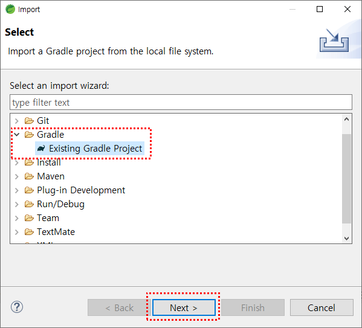
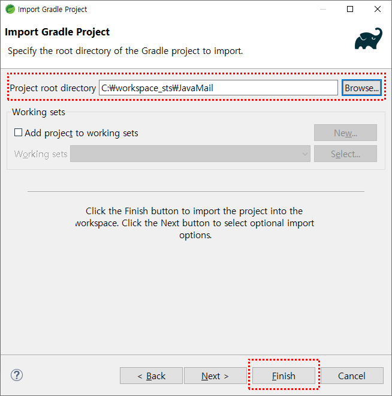
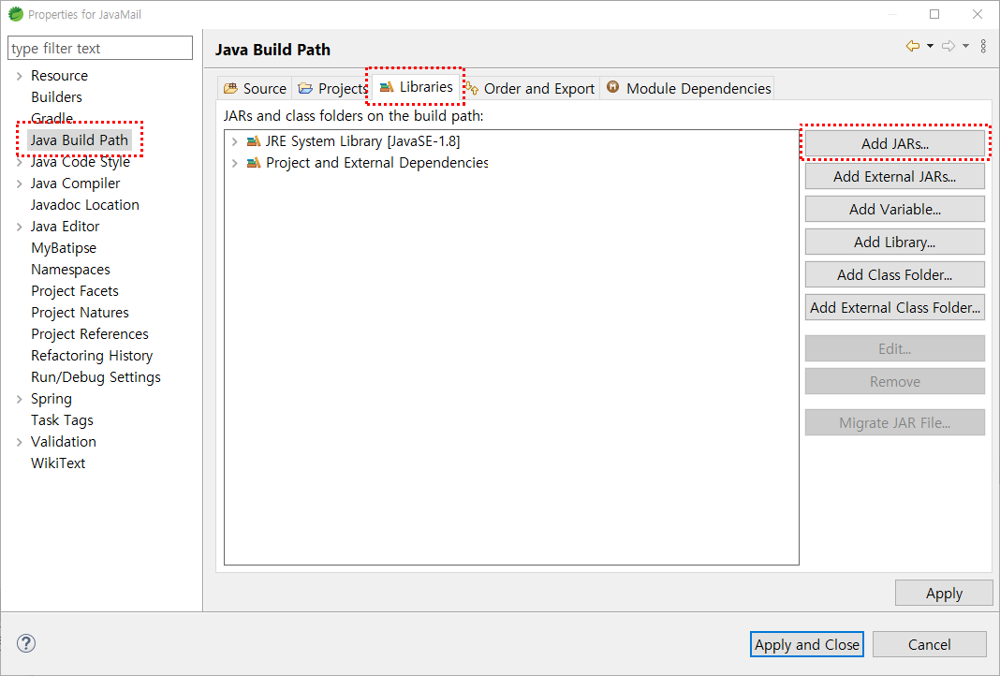
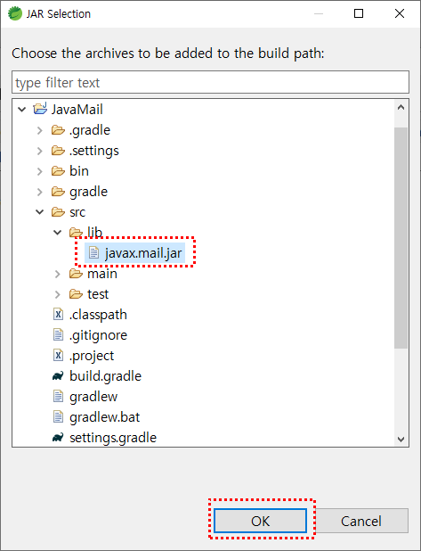
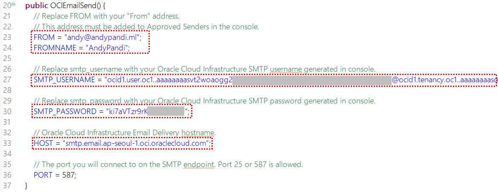
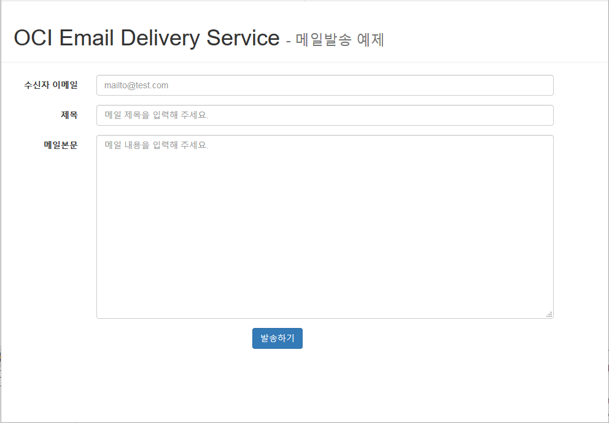

# Oracle APEX with Email Delivery

이번에 테스트할 내용은 Oracle의 low-code platform 인 Oracle APEX(Application express)을 활용한 Email Delivery Service 사용 입니다.

#### Part 1. OCI Email Delivery 설정

JavaMail 을 사용한 메일발송 테스트에 앞서 OCI Email Delivery 설정이 필요한데 이 부분은 모든 예제가 동일하므로  [APEX 를 활용한 Email Delivery](./APEX) 의 Part 1 ~ Part 3 참조 하시면 됩니다.

#### Part 2. JavaMail 을 활용한 Email Delivery 사용

간편한 실습을 위해 Spring boot 를 활용한 Email 발송 웹애플리케이션을 만들어보겠습니다.

1. 개발을 위한 IDE를 설치합니다. 여기서는 Spring Tool Suite 를 사용합니다.

   다운로드 : https://spring.io/tools

2. 소스 다운로드

   현재 GitHub 의 JavaMail 폴더 전체가 필요하므로 ```Download ZIP``` 을 통해서 소스파일을 다운받습니다.

3. Gradle Project 추가

   Spring Tool Suite 의 상단메뉴에서 File > Import 클릭

   Import Select 창에서 Gradle > Existing Gradle Project 선택 후 ```Next``` 버튼 클릭

   

   Project root directory 는 GitHub에서 다운받은 소스의 JavaMail 폴더를 선택한 뒤 ```Finish``` 버튼 클릭

   

   생성된 Project를 보면 x 표시가 되어있습니다. 이는 javax.mail 라이브러리가 추가되지 않아서 발생한 이슈입니다.

   라이브러리를 추가해줍니다.

   Package Explorer에서 해당 프로젝트에서 마우스 오른쪽 클릭 후 **Properties** 메뉴는 클릭

   **Java Build Path** 로 이동한 뒤 **Libraries** 탭 에서 **```Add JARs...```** 버튼 클릭

   

   JAR Selection 창에서 JavaMail > src > lib 경로의 **javax.mail.jar** 를 선택한 뒤 ```OK``` 버튼 클릭

   

   **```Apply and Close```** 버튼 클릭

   이제 오류표시는 사라지고 프로젝트가 정상적으로 Build 되었습니다.

4. OCI Email Delivery 설정

   이제 OCI Email Delivery 사용을 위한 설정값을 추가해야 합니다.

   JavaMail > src/main/java > com.oci > **OCIEmailSend.java** 파일을 열어서 20라인 이후에 있는 아래 항목을 수정합니다.

   - FROM : OCI Console 에서 입력한 Approval Sender Email 주소입니다.
   - FROMNAME : 발송자명 입니다.
   - SMTP_USERNAME : OCI User 의 SMTP Username 입니다. **<Part 1>** 참조
   - SMTP_PASSWORD : OCI User 의 SMTP Password 입니다. **<Part 1>** 참조
   - HOST : OCI Email Delivery hostname 입니다.  [SMTP Connection Endpoints](https://docs.oracle.com/en-us/iaas/Content/Email/Tasks/configuresmtpconnection.htm) 참조

   

5. 웹애플리케이션 실행

   Spring Tool Suite 왼쪽 Package Explorer 의 해당 프로젝트에서 마우스 오른쪽 클릭 후 **Run As > Spring Boot App** 클릭

   웹브라우저 실행 후 http://localhost:8080/emailWrite.do 로 접속해봅니다.

   

   수신자 이메일, 제목, 메일본문 입력 후 **```발송하기```** 버튼 클릭.

   메일발송 완료.